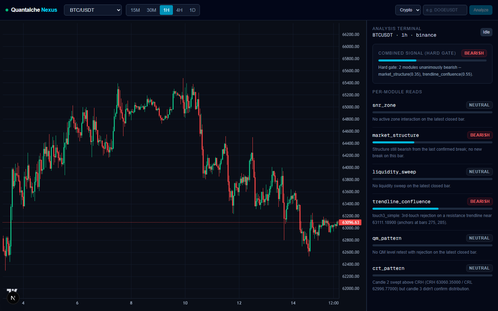

# Quantalche Nexus

A modular trading-signal engine for forex and crypto, built from a 22-document
private source corpus on the "Alchemist" methodology (and the frameworks it
synthesizes: ICT, SMC, MSNR, CRT, Quarterly Theory, SMT/SSMT, and others).
Every rule the engine executes — every zone, every structure break, every
entry/stop/take-profit — traces back to a specific page in that corpus, or is
explicitly flagged as an editorial judgment call when the material doesn't
give one. Nothing is silently invented.



## Why this project is interesting

Most "combine several indicators into a signal" projects invent their own
combination logic. This one doesn't get to: the source corpus is 22
independently-authored documents that frequently disagree, use the same term
for different things, or simply don't specify how components should combine.
The engineering problem isn't "build a trading bot" — it's **build a system
that's honest about what a genuinely messy, real-world source of truth does
and doesn't support**, and prove it with live data instead of asserting it.

Concretely, that means:

- **Document-as-ground-truth.** Every rule-check function cites its source
  document/section in [`docs/rule-mapping.md`](docs/rule-mapping.md). Where
  two documents give conflicting figures (e.g. two different minimum
  reward:risk floors), both are cited and the choice between them is
  explained, not hidden.
- **Empirically-checked, not assumed.** Every module was live-validated
  against real market data before being trusted, and every threshold that
  isn't source-stated (a swing-detection window, a gap-size filter) was
  calibrated against real data distributions and documented as a judgment
  call, not presented as if the source specified it.
- **Findings get reported even when they're not flattering.** One module
  (`quarterly_theory`) tests well standalone but collapses signal frequency
  to near-zero when hard-gated with the others — so it ships, disabled by
  default, with the reasoning written down instead of quietly excluded.
  Backtest results below include the worst-performing instrument, not just
  the best.
- **Disagreement is surfaced, not averaged away.** The default aggregation
  mode requires unanimous agreement among active modules; when they conflict,
  the result is a first-class `CONFLICT` state, not a blended number.
- **Non-repainting by construction.** Every data client drops the
  still-forming bar before it reaches any analysis code — the live dashboard
  can show a forming candle for visual feedback, but the signal pipeline
  never sees it.

## What it does

Given a symbol + timeframe, nine independent analysis modules each produce
their own bias and confidence (support/resistance zones, market structure
breaks, liquidity sweeps, trendline confluence, Quasimodo patterns, CRT/PO3,
plus three opt-in modules — see below). A hard-gate aggregator combines them:
if the active modules don't unanimously agree, there's no trade — disagreement
becomes a `CONFLICT` state, not a diluted average. A confirmed signal gets a
real limit-order entry, a stop at the nearest opposing structural level, and
a take-profit that has to clear a minimum reward:risk floor or the signal is
rejected outright. From there it's tracked through a real state machine
(`PENDING → SIGNAL_ACTIVE → STOPPED_OUT | TP_HIT | EXPIRED`) so a signal can't
be credited with price movement that happened before it was actually
triggered.

The live dashboard shows this as it happens: a real-time chart (Binance
WebSocket for crypto, polled for forex given Twelve Data's free-tier rate
limit), an "Analysis Terminal" panel with every module's individual read
alongside the combined signal, and an "Analyze" control to run the full
pipeline on demand for any symbol outside the auto-refreshing 7-pair
watchlist.

## Architecture

| Layer | Package | What it is |
|---|---|---|
| 0 — Knowledge extraction | [`docs/phase0-knowledge-extraction.md`](docs/phase0-knowledge-extraction.md) | The module inventory + combination-rule map, derived from the full source corpus |
| 1 — Data ingestion | `quantalche.ingestion` | Binance (crypto) + Twelve Data (forex) OHLC clients, non-repainting |
| 2 — Analysis modules | `quantalche.analysis` | 9 independent modules — see [`backend/README.md`](backend/README.md) |
| 3 — Aggregation | `quantalche.aggregation` | Hard-gate (unanimity, live default) or soft-score (confidence-weighted, backtest-only) |
| 5/6 — Confirmation + lifecycle | `quantalche.execution` | Entry/SL/TP calculation + signal state machine |
| 7 — Backtesting | `quantalche.backtest` | Bar-by-bar non-repainting replay, walk-forward segmentation, per-module accuracy |
| 8 — API + web app | `quantalche.api` / `frontend/` | FastAPI (REST + WebSocket) + Next.js live dashboard |
| 9 — Alerting | `quantalche.alerting` | Webhook / Discord / Telegram on signal state transitions |

Full design rationale: [`docs/architecture.md`](docs/architecture.md). Every
rule's citation: [`docs/rule-mapping.md`](docs/rule-mapping.md) — the file
that keeps the rest of this honest.

## Backtest snapshot

Hard-gate, 1h bars, all 7 watchlist instruments, walk-forward segmented
(regenerate with `backend/scripts/full_backtest_report.py`):

| Instrument | Signals | Resolved | Win rate | Expectancy |
|---|---|---|---|---|
| SOL/USDT | 52 | 41 | 41.5% | +0.41R |
| BTC/USDT | 50 | 39 | 41.0% | +0.30R |
| ETH/USDT | 51 | 40 | 32.5% | +0.21R |
| GBP/USD | 40 | 32 | 31.3% | +0.24R |
| EUR/USD | 38 | 26 | 26.9% | +0.04R |
| XRP/USDT | 43 | 28 | 21.4% | -0.30R |
| XAU/USD | 32 | 23 | 8.7% | -0.68R |

Pooled: 229 resolved trades, 31.0% win rate, ~+0.09R expectancy. Deliberately
shown in full, including the worst instrument — a backtest that only reports
its best number isn't a backtest.

## Quick start

```
# backend
cd backend
python -m venv .venv && .venv\Scripts\activate
pip install -e .
cp .env.example .env   # add a free Twelve Data key for forex; crypto needs none
python -m uvicorn quantalche.api.app:app --reload --port 8000

# frontend (separate terminal)
cd frontend
npm install
cp .env.local.example .env.local
npm run dev
```

Full setup/usage details: [`backend/README.md`](backend/README.md),
[`frontend/README.md`](frontend/README.md).

## Repo practice

- One branch per unit of work, merged to `main` after its validation step
  passes.
- Meaningful checkpoints are tagged (`v0.0` … `v0.18` so far).
- Commits are pushed at every meaningful step so progress and regressions are
  traceable.

## Disclaimer

This is a decision-support tool, not financial advice, built and shared here
as an engineering showcase. No license is granted for reuse of the code or
the trading logic it implements — see it, don't fork it for trading.
